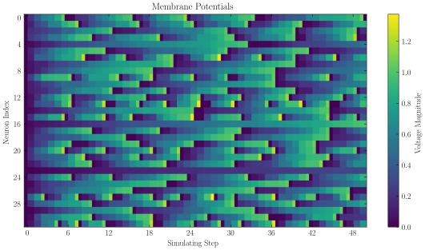

# SpikingFlow

[](https://spikingflow.readthedocs.io/zh_CN/latest)
[](http://hits.dwyl.com/fangwei123456/SpikingFlow)

[中文README](https://github.com/fangwei123456/SpikingFlow/blob/master/README_cn.md)



<center class="half">
    
</center>


SpikingFlow is an open-source deep learning framework for Spiking Neural Network (SNN) based on [PyTorch](https://pytorch.org/).

The documentation of SpikingFlow is written in both English and Chinese: https://spikingflow.readthedocs.io

## Installation

Note that SpikingFlow is based on PyTorch. Please make sure that you have installed PyTorch before you install SpikingFlow.

Install from [PyPI](https://pypi.org/project/SpikingFlow/)：

```bash
pip install SpikingFlow
```

Developers can download the latest version from GitHub:

```bash
git clone https://github.com/fangwei123456/SpikingFlow.git
```

## Build SNN In An Unprecedented Simple Way

SpikingFlow is user-friendly. Building SNN with SpikingFlow is as simple as building ANN in PyTorch:

```python
class Net(nn.Module):
    def __init__(self, tau=100.0, v_threshold=1.0, v_reset=0.0):
        super().__init__()
        # Network structure, a simple two-layer fully connected network, each layer is followed by LIF neurons
        self.fc = nn.Sequential(
            nn.Flatten(),
            nn.Linear(28 * 28, 14 * 14, bias=False),
            neuron.LIFNode(tau=tau, v_threshold=v_threshold, v_reset=v_reset),
            nn.Linear(14 * 14, 10, bias=False),
            neuron.LIFNode(tau=tau, v_threshold=v_threshold, v_reset=v_reset)
        )

    def forward(self, x):
        return self.fc(x)
```

This simple network with a Poisson encoder can achieve 92% accuracy on MNIST test dataset. Read [the tutorial of clock driven](https://spikingflow.readthedocs.io/zh_CN/latest/tutorial_en.clock_driven.html) for more details. You can also run this code in Python terminal for training on classifying MNIST:

```python
>>> import SpikingFlow.clock_driven.examples.lif_fc_mnist as lif_fc_mnist
>>> lif_fc_mnist.main()
```

Read [SpikingFlow.clock_driven.examples](https://spikingflow.readthedocs.io/zh_CN/latest/SpikingFlow.clock_driven.examples.html) to explore more advanced networks!

## About

[Multimedia Learning Group, Institute of Digital Media (NELVT), Peking University](https://pkuml.org/) is the main developer of SpikingFlow.

The list of developers can be found [here](https://github.com/fangwei123456/SpikingFlow/graphs/contributors).

Any contributions to SpikingFlow is welcome!
